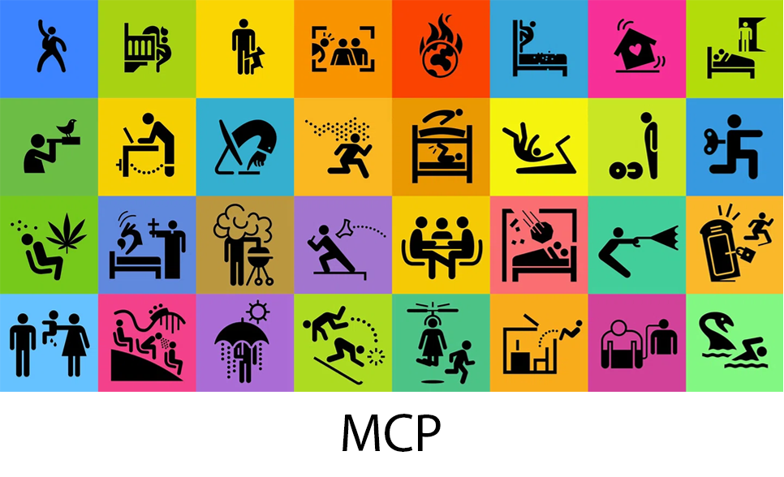

<div align="center">



# <picture><source media="(prefers-color-scheme: dark)" srcset="docs/icons/palette-white.svg"></picture> Noun MCP Server

[](https://www.npmjs.com/package/@alisaitteke/noun-mcp)
[](https://opensource.org/licenses/MIT)
[](https://nodejs.org/)

> **⚠️ Unofficial Project** · This is an independent third-party tool using The Noun Project API. Not affiliated with or endorsed by The Noun Project.

MCP (Model Context Protocol) server for searching, downloading, and using icons from The Noun Project in **Cursor AI**, **Claude Desktop**, and other MCP-supported AI tools.

---

### 🚀 Quick Start

<table>
<tr>
<td width="33%">

**Cursor AI**

Add to MCP settings:

```json
{
  "mcpServers": {
    "noun-project": {
      "command": "npx",
      "args": ["-y", "@alisaitteke/noun-mcp"],
      "env": {
        "NOUN_CONSUMER_KEY": "your_key",
        "NOUN_CONSUMER_SECRET": "your_secret",
        "NOUN_API_TIER": "FREE"
      }
    }
  }
}
```

</td>
<td width="33%">

**Claude Desktop**

Add to config:

```json
{
  "mcpServers": {
    "noun-project": {
      "command": "npx",
      "args": ["-y", "@alisaitteke/noun-mcp"],
      "env": {
        "NOUN_CONSUMER_KEY": "your_key",
        "NOUN_CONSUMER_SECRET": "your_secret",
        "NOUN_API_TIER": "FREE"
      }
    }
  }
}
```

</td>
<td width="33%">

**Claude Code**

Run in terminal:

```bash
claude mcp add \
  --transport stdio \
  noun-project \
  --env NOUN_CONSUMER_KEY=your_key \
  --env NOUN_CONSUMER_SECRET=your_secret \
  --env NOUN_API_TIER=FREE \
  -- npx -y @alisaitteke/noun-mcp
```

</td>
</tr>
</table>

[Get your API keys →](https://thenounproject.com/developers/apps/)

</div>

> **What is this?** A bridge that lets AI assistants search and download professional icons for your projects. No manual browsing needed - just ask your AI!

## <picture><source media="(prefers-color-scheme: dark)" srcset="docs/icons/star-white.svg"></picture> Features

- <picture><source media="(prefers-color-scheme: dark)" srcset="docs/icons/search-white.svg"></picture> **Icon Search**: Find icons with filters for style, line weight, and licensing
- <picture><source media="(prefers-color-scheme: dark)" srcset="docs/icons/download-white.svg"></picture> **Icon Download**: Get SVG or PNG files with custom colors and sizes
- <picture><source media="(prefers-color-scheme: dark)" srcset="docs/icons/book-white.svg"></picture> **Collection Browser**: Explore curated icon collections
- <picture><source media="(prefers-color-scheme: dark)" srcset="docs/icons/lightbulb-white.svg"></picture> **Smart Suggestions**: Autocomplete helps find the right search terms
- <picture><source media="(prefers-color-scheme: dark)" srcset="docs/icons/chart-white.svg"></picture> **Usage Tracking**: Monitor your API usage and limits
- <picture><source media="(prefers-color-scheme: dark)" srcset="docs/icons/free-white.svg"></picture> **FREE Tier Mode**: Smart optimizations for 5K monthly API calls
- <picture><source media="(prefers-color-scheme: dark)" srcset="docs/icons/diamond-white.svg"></picture> **PAID Tier Mode**: Unlimited access with no restrictions
- <picture><source media="(prefers-color-scheme: dark)" srcset="docs/icons/rocket-white.svg"></picture> **Easy Setup**: Install and run in minutes
- <picture><source media="(prefers-color-scheme: dark)" srcset="docs/icons/lock-white.svg"></picture> **Secure**: OAuth 1.0a authentication
- <picture><source media="(prefers-color-scheme: dark)" srcset="docs/icons/lightning-white.svg"></picture> **Fast**: Built-in rate limiting and caching

## <picture><source media="(prefers-color-scheme: dark)" srcset="docs/icons/checklist-white.svg"></picture> Requirements

- **Node.js** 18 or higher ([Download](https://nodejs.org/))
- **The Noun Project API Keys** (free account works!)

Don't have API keys? [Get them here →](https://thenounproject.com/developers/apps/)

## <picture><source media="(prefers-color-scheme: dark)" srcset="docs/icons/rocket-white.svg"></picture> Quick Start

### <picture><source media="(prefers-color-scheme: dark)" srcset="docs/icons/key-white.svg"></picture> Step 1: Get Your API Keys

1. Go to [The Noun Project Developers](https://thenounproject.com/developers/apps/)
2. Sign in or create a free account
3. Create a new app (or select an existing one)
4. Copy your **Consumer Key** and **Consumer Secret**

### <picture><source media="(prefers-color-scheme: dark)" srcset="docs/icons/package-white.svg"></picture> Step 2: Installation

**Option A: npx (Easiest - No Install Required)**

```bash
# Run directly without installation
npx @alisaitteke/noun-mcp
```

**Option B: Global Install**

```bash
npm install -g @alisaitteke/noun-mcp
```

**Option C: Local Development**

```bash
git clone https://github.com/alisaitteke/noun-mcp.git
cd noun-mcp
npm install
npm run build
npm link
```

### <picture><source media="(prefers-color-scheme: dark)" srcset="docs/icons/gear-white.svg"></picture> Step 3: Configure Environment

Create a `.env` file in the project directory:

```bash
cp .env.example .env
```

Edit `.env` with your credentials:

```env
# Your API credentials from The Noun Project
NOUN_CONSUMER_KEY=your_consumer_key_here
NOUN_CONSUMER_SECRET=your_consumer_secret_here

# Choose your tier: FREE (5K calls/month) or PAID (unlimited)
NOUN_API_TIER=FREE
```

#### <picture><source media="(prefers-color-scheme: dark)" srcset="docs/icons/free-white.svg"></picture> FREE vs <picture><source media="(prefers-color-scheme: dark)" srcset="docs/icons/diamond-white.svg"></picture> PAID Tier

**FREE Tier (5,000 API calls/month)**
- <picture><source media="(prefers-color-scheme: dark)" srcset="docs/icons/checkmark-white.svg"></picture> Perfect for personal projects and testing
- <picture><source media="(prefers-color-scheme: dark)" srcset="docs/icons/checkmark-white.svg"></picture> Automatic cost optimizations
- <picture><source media="(prefers-color-scheme: dark)" srcset="docs/icons/checkmark-white.svg"></picture> Smaller page sizes (max 10 results per search)
- <picture><source media="(prefers-color-scheme: dark)" srcset="docs/icons/checkmark-white.svg"></picture> Optimized thumbnails (42px by default)
- <picture><source media="(prefers-color-scheme: dark)" srcset="docs/icons/checkmark-white.svg"></picture> SVG URLs excluded by default (save bandwidth)
- <picture><source media="(prefers-color-scheme: dark)" srcset="docs/icons/checkmark-white.svg"></picture> Smart usage alerts at 50%, 80%, 95%

**PAID Tier (Unlimited)**
- <picture><source media="(prefers-color-scheme: dark)" srcset="docs/icons/checkmark-white.svg"></picture> No monthly limits
- <picture><source media="(prefers-color-scheme: dark)" srcset="docs/icons/checkmark-white.svg"></picture> Larger page sizes (up to 100 results)
- <picture><source media="(prefers-color-scheme: dark)" srcset="docs/icons/checkmark-white.svg"></picture> High-quality thumbnails (84px by default)
- <picture><source media="(prefers-color-scheme: dark)" srcset="docs/icons/checkmark-white.svg"></picture> SVG URLs included automatically
- <picture><source media="(prefers-color-scheme: dark)" srcset="docs/icons/checkmark-white.svg"></picture> No restrictions

<picture><source media="(prefers-color-scheme: dark)" srcset="docs/icons/lightbulb-white.svg"></picture> **Switch anytime:** Just update `NOUN_API_TIER` in your `.env` file!

### <picture><source media="(prefers-color-scheme: dark)" srcset="docs/icons/desktop-white.svg"></picture> Step 4: Configure Cursor AI

Open Cursor settings: **Settings → Features → MCP**

Add this configuration:

**Option A: Using npx (Recommended)**

```json
{
  "mcpServers": {
    "noun-project": {
      "command": "npx",
      "args": ["@alisaitteke/noun-mcp"],
      "env": {
        "NOUN_CONSUMER_KEY": "your_key_here",
        "NOUN_CONSUMER_SECRET": "your_secret_here",
        "NOUN_API_TIER": "FREE"
      }
    }
  }
}
```

**Option B: Using global install**

```json
{
  "mcpServers": {
    "noun-project": {
      "command": "noun-mcp",
      "env": {
        "NOUN_CONSUMER_KEY": "your_key_here",
        "NOUN_CONSUMER_SECRET": "your_secret_here",
        "NOUN_API_TIER": "FREE"
      }
    }
  }
}
```

**Option C: Using local build**

```json
{
  "mcpServers": {
    "noun-project": {
      "command": "node",
      "args": ["/path/to/noun-mcp/dist/index.js"],
      "env": {
        "NOUN_CONSUMER_KEY": "your_key_here",
        "NOUN_CONSUMER_SECRET": "your_secret_here",
        "NOUN_API_TIER": "FREE"
      }
    }
  }
}
```

### <picture><source media="(prefers-color-scheme: dark)" srcset="docs/icons/desktop-white.svg"></picture> Step 5: Configure Claude Desktop

Edit: `~/Library/Application Support/Claude/claude_desktop_config.json`

**Using npx (Recommended)**

```json
{
  "mcpServers": {
    "noun-project": {
      "command": "npx",
      "args": ["@alisaitteke/noun-mcp"],
      "env": {
        "NOUN_CONSUMER_KEY": "your_key_here",
        "NOUN_CONSUMER_SECRET": "your_secret_here",
        "NOUN_API_TIER": "FREE"
      }
    }
  }
}
```

## <picture><source media="(prefers-color-scheme: dark)" srcset="docs/icons/chat-white.svg"></picture> Usage Examples

Once configured, just talk to your AI naturally:

### Search for Icons
```
"Find me some coffee cup icons"
"Search for solid style house icons"
"Show me line icons with weight 18-20 for 'bicycle'"
```

### Download Icons
```
"Download icon 12345 in red color"
"Get icon 67890 as PNG, 200x200 pixels, save to ./icons/house.png"
"Download this icon as SVG with hex color FF5733"
```

### Browse Collections
```
"Search for weather icon collections"
"Show me collection 123 details"
```

### Get Suggestions
```
"Give me autocomplete suggestions for 'spo'"
```

### Check Usage
```
"How many API calls have I used this month?"
"Check my API usage limits"
```

## <picture><source media="(prefers-color-scheme: dark)" srcset="docs/icons/wrench-white.svg"></picture> Available Tools

The AI can use these tools to help you:

### `search_icons`
Search The Noun Project icon database.

**What you can filter:**
- **Style**: `solid`, `line`, or both
- **Line weight**: `1-60` or range like `"18-20"`
- **Public domain**: Show only free-to-use icons
- **Thumbnail size**: `42`, `84`, or `200` pixels
- **Include SVG**: Get SVG URLs in results
- **Limit**: Max results per page

**Example:**
```
"Search for 'coffee' icons in solid style, public domain only"
```

### `get_icon`
Get detailed information about a specific icon.

**Returns:**
- Icon name and ID
- Creator information
- Tags and collections
- License details
- Download URLs

**Example:**
```
"Show me details for icon 12345"
```

### `download_icon`
Download an icon with custom options.

**Options:**
- **Format**: SVG or PNG
- **Color**: Any hex color (e.g., "FF0000" for red)
- **Size**: 20-1200 pixels (PNG only)
- **Save to file**: Optional file path

**Note:** FREE tier can only download public domain icons.

**Example:**
```
"Download icon 12345 as PNG, 200x200, red color, save to ./icons/coffee.png"
```

### `search_collections`
Find icon collections by keyword.

**Example:**
```
"Search for 'travel' collections"
```

### `get_collection`
View a specific collection with all its icons.

**Example:**
```
"Show me collection 456"
```

### `icon_autocomplete`
Get search term suggestions (max 10).

**Example:**
```
"What terms start with 'comp'?"
```

### `check_usage`
Check your API usage and limits.

**Shows:**
- Monthly limit and usage
- Remaining calls
- Percentage used
- Days until reset
- Optimization tips (FREE tier)

## <picture><source media="(prefers-color-scheme: dark)" srcset="docs/icons/free-white.svg"></picture> FREE Tier Best Practices

Maximize your 5,000 monthly calls:

### 1. Be Specific
```
Bad:  "icon"       → Too broad, many pages needed
Good: "coffee cup" → Specific, better results
```

### 2. Use Autocomplete First
```
Step 1: "Suggestions for 'cof'"  → ["coffee", "coffee cup"]
Step 2: "Search for 'coffee cup'" → Exact results
```

### 3. Avoid Pagination
```
Bad:  Browsing 5 pages = 5 API calls
Good: Refine search to get results on first page
```

### 4. Download Once, Reuse
```
Download icon → Save to project → Use everywhere
(Don't re-download the same icon)
```

### 5. Filter for Public Domain
```
FREE tier can only download public domain icons
Filter searches with limit_to_public_domain=1
```

### 6. Cache Results
The server automatically caches usage data for 5 minutes.
You should also save:
- Downloaded icons
- Icon IDs you've explored
- Collection information

## <picture><source media="(prefers-color-scheme: dark)" srcset="docs/icons/chart-white.svg"></picture> Cost Optimization

The server automatically optimizes API usage in FREE tier mode:

| Feature | FREE Tier | PAID Tier |
|---------|-----------|-----------|
| Results per page | 10 max | 100 max |
| Default thumbnail | 42px | 84px |
| SVG URLs | Excluded | Included |
| Pagination warnings | Yes | No |
| Usage alerts | 50%, 80%, 95% | None |

**Want full details?** See [COST_OPTIMIZATION.md](COST_OPTIMIZATION.md)

## <picture><source media="(prefers-color-scheme: dark)" srcset="docs/icons/wrench-white.svg"></picture> Development

### Run in Development Mode

```bash
npm install
npm run dev
```

### Build for Production

```bash
npm run build
```

### Run Built Version

```bash
npm start
```

### Project Structure

```
noun-mcp/
├── src/
│   ├── index.ts              # MCP server entry point
│   ├── api/
│   │   ├── auth.ts          # OAuth 1.0a authentication
│   │   └── client.ts        # API client with rate limiting
│   ├── tools/
│   │   ├── search.ts        # Icon search functionality
│   │   ├── download.ts      # Icon download & details
│   │   ├── collections.ts   # Collections & autocomplete
│   │   └── usage.ts         # Usage monitoring
│   ├── types/
│   │   └── schemas.ts       # Zod schemas & TypeScript types
│   └── utils/
│       └── costOptimizer.ts # Cost optimization logic
├── package.json
├── tsconfig.json
└── README.md
```

## <picture><source media="(prefers-color-scheme: dark)" srcset="docs/icons/bug-white.svg"></picture> Troubleshooting

### "Missing required environment variables"

**Problem:** API keys not found.

**Solution:**
1. Check `.env` file exists
2. Verify `NOUN_CONSUMER_KEY` and `NOUN_CONSUMER_SECRET` are set
3. Check for typos in variable names

### "Authentication failed"

**Problem:** Invalid API credentials.

**Solution:**
1. Verify credentials at [developers page](https://thenounproject.com/developers/apps/)
2. Make sure you copied the entire key/secret
3. Check for extra spaces or quotes

### "Rate limit exceeded"

**Problem:** Too many requests too fast.

**Solution:**
- Wait a moment (limit is 100 requests/minute)
- The server automatically handles rate limiting
- If persistent, check your usage with `check_usage` tool

### SVG URLs Not Working

**Problem:** SVG URLs expire after 1 hour.

**Solution:**
- Download fresh URLs when needed
- Use `download_icon` to get base64-encoded icons
- Save icons locally instead of relying on URLs

### "Free API access is limited to public domain icons"

**Problem:** Trying to download non-public-domain icon with FREE account.

**Solution:**
- Filter searches: `limit_to_public_domain=1`
- Or upgrade to PAID tier at [pricing page](https://thenounproject.com/pricing)

### Server Not Appearing in Cursor/Claude

**Problem:** MCP server not detected.

**Solution:**
1. Restart Cursor AI or Claude Desktop
2. Check JSON config syntax (no trailing commas!)
3. Verify file paths are absolute
4. Check server logs for errors

## <picture><source media="(prefers-color-scheme: dark)" srcset="docs/icons/document-white.svg"></picture> API Limits

| Tier | Monthly Limit | Rate Limit | Download Access |
|------|---------------|------------|-----------------|
| FREE | 5,000 calls | 100/min | Public domain only |
| PAID | Unlimited | 100/min | All icons |

**Want more?** Check [The Noun Project Pricing](https://thenounproject.com/pricing)

## <picture><source media="(prefers-color-scheme: dark)" srcset="docs/icons/handshake-white.svg"></picture> Contributing

Contributions are welcome!

1. Fork the repository
2. Create a feature branch: `git checkout -b feature/amazing-feature`
3. Commit changes: `git commit -m 'Add amazing feature'`
4. Push to branch: `git push origin feature/amazing-feature`
5. Open a Pull Request

## <picture><source media="(prefers-color-scheme: dark)" srcset="docs/icons/document-white.svg"></picture> License

MIT License - see [LICENSE](LICENSE) file for details.

## <picture><source media="(prefers-color-scheme: dark)" srcset="docs/icons/heart-white.svg"></picture> Acknowledgments

- [The Noun Project](https://thenounproject.com/) - For the amazing icon collection
- [Model Context Protocol](https://modelcontextprotocol.io/) - For the MCP specification
- [Anthropic](https://www.anthropic.com/) - For Claude and MCP development

## <picture><source media="(prefers-color-scheme: dark)" srcset="docs/icons/email-white.svg"></picture> Support

- **Issues:** [GitHub Issues](https://github.com/alisaitteke/noun-mcp/issues)
- **Documentation:** [The Noun Project API Docs](https://api.thenounproject.com/documentation.html)
- **Pricing:** [The Noun Project Plans](https://thenounproject.com/pricing)

## <picture><source media="(prefers-color-scheme: dark)" srcset="docs/icons/link-white.svg"></picture> Links

- [The Noun Project](https://thenounproject.com/)
- [The Noun Project API](https://api.thenounproject.com/)
- [MCP Documentation](https://modelcontextprotocol.io/)
- [Cursor AI](https://cursor.sh/)
- [Claude](https://claude.ai/)

---

**Note:** This is a community-built MCP server and is not an official product of The Noun Project.

Made with <picture><source media="(prefers-color-scheme: dark)" srcset="docs/icons/heart-white.svg"></picture> for the AI and developer community.
