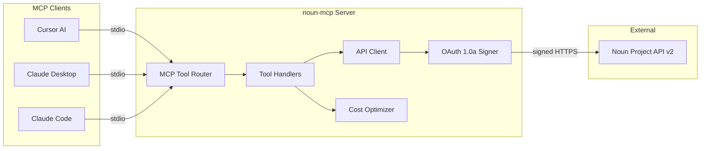

# Architecture

> Technical overview of **@alisaitteke/noun-mcp** — an MCP (Model Context Protocol) stdio server that bridges AI assistants to [The Noun Project API v2](https://api.thenounproject.com/documentation.html).

## Overview

The server exposes seven MCP tools for icon search, download, collection browsing, autocomplete, and usage monitoring. It runs as a long-lived Node.js process communicating over **stdio** with MCP-compatible clients (Cursor, Claude Desktop, Claude Code, and others).

Core responsibilities:

1. **Protocol adaptation** — Map MCP tool calls to Noun Project REST endpoints
2. **Authentication** — Sign every outbound request with OAuth 1.0a (HMAC-SHA1)
3. **Resilience** — Rate limiting, actionable error messages, request timeouts
4. **Cost awareness** — FREE-tier optimizations to protect the 5,000 calls/month quota

## System Context



## Layer Breakdown

### Entry point — `src/index.ts`

- Instantiates the MCP `Server` with tool capability
- Registers `ListTools` and `CallTool` handlers
- Boot sequence: cost optimizer → OAuth init → API client → stdio transport
- Routes each tool name to its handler in `src/tools/`

### Authentication — `src/api/auth.ts`

- OAuth 1.0a via `oauth-1.0a` + Node `crypto` HMAC-SHA1
- Credentials loaded from `NOUN_CONSUMER_KEY` and `NOUN_CONSUMER_SECRET`
- `getOAuthHeaders(url, method)` produces the `Authorization` header per request
- Fails fast with setup instructions when env vars are missing

### API client — `src/api/client.ts`

- Axios instance targeting `https://api.thenounproject.com/v2`
- Request interceptor attaches OAuth headers to every call
- Response interceptor maps HTTP status codes to actionable errors (401, 404, 429)
- **Bottleneck** rate limiter: max 5 concurrent, 600 ms min spacing (~100 req/min API limit)
- All public functions (`searchIcons`, `getIcon`, `downloadIcon`, etc.) go through `makeRequest()` for consistent limiting

### Cost optimizer — `src/utils/costOptimizer.ts`

- Reads `NOUN_API_TIER` (`FREE` | `PAID`) at startup
- **FREE tier** (default): caps page size at 10, uses 42px thumbnails, excludes SVG URLs unless explicitly requested, emits usage warnings at 50/80/95%
- **PAID tier**: passes through user limits, includes SVG by default, no pagination warnings
- Applied transparently inside `client.ts` so tool handlers stay simple

### Tool handlers — `src/tools/`

| Module | Tools | Role |
| --- | --- | --- |
| `search.ts` | `search_icons` | Query icons with style, weight, public-domain filters |
| `download.ts` | `get_icon`, `download_icon` | Metadata lookup and file download (SVG/PNG, color, size) |
| `collections.ts` | `search_collections`, `get_collection`, `icon_autocomplete` | Collection browse and search suggestions |
| `usage.ts` | `check_usage` | Monthly quota with 5-minute LRU cache |

### Types — `src/types/schemas.ts`

- Zod schemas validate tool inputs at the handler boundary
- Shared TypeScript interfaces for API response shapes
- Keeps MCP `inputSchema` (JSON Schema) and runtime validation aligned

## Request Flow (example: `search_icons`)

```mermaid
sequenceDiagram
  participant Client as MCP Client
  participant Index as index.ts
  participant Search as search.ts
  participant Opt as costOptimizer
  participant API as client.ts
  participant Auth as auth.ts
  participant Noun as Noun API

  Client->>Index: CallTool search_icons
  Index->>Search: handleSearchIcons(args)
  Search->>Search: Zod validate input
  Search->>API: searchIcons(query, options)
  API->>Opt: optimizeLimit, shouldIncludeSvg
  API->>Auth: getOAuthHeaders(url, GET)
  Auth-->>API: Authorization header
  API->>Noun: GET /v2/icon?query=...
  Noun-->>API: JSON response
  API-->>Search: icons[]
  Search-->>Index: MCP text content
  Index-->>Client: tool result
```

## Design Decisions

| Decision | Rationale | Alternatives considered |
| --- | --- | --- |
| **stdio transport** | Standard MCP distribution via `npx`; no open ports or HTTP server to secure | HTTP/SSE transport — rejected for simpler install |
| **Bottleneck rate limiter** | Enforces Noun API 100 req/min limit proactively; avoids 429 storms | Manual retry loops — less predictable under load |
| **Tier-aware defaults in client layer** | Single place for FREE/PAID policy; tool handlers stay thin | Per-tool optimization — duplicated logic |
| **LRU cache on usage (5 min)** | `check_usage` is polled often; caching saves quota on FREE tier | No cache — wastes calls on repeated status checks |
| **Zod at handler boundary** | Runtime safety for LLM-generated arguments; clear error messages | Trust MCP schema only — insufficient for malformed input |
| **OAuth per-request signing** | Required by Noun Project API; no long-lived tokens to manage | API key header — not supported by upstream |
| **Actionable error messages** | 401/429/404 include next steps (verify keys, wait, check URL) | Raw API errors — poor DX for AI-assisted workflows |

## MCP Tool Surface

| Tool | Required input | Key behavior |
| --- | --- | --- |
| `search_icons` | `query` | Filters: style, line weight, public domain, pagination |
| `get_icon` | `icon_id` | Metadata, tags, creator, license, thumbnail URLs |
| `download_icon` | `icon_id` | SVG or PNG; optional color, size, local file save |
| `search_collections` | `query` | Curated collection search |
| `get_collection` | `collection_id` | Collection detail with paginated icons |
| `icon_autocomplete` | `query` | Up to 10 search suggestions |
| `check_usage` | _(none)_ | Monthly limit/usage; cached 5 min on FREE tier |

## Error Handling Philosophy

Errors are translated before they reach the MCP client:

- **401** — Credential mismatch; link to developer portal
- **404** — Resource not found with request path
- **429** — Rate limit; advise waiting (server also pre-limits via Bottleneck)
- **Network** — Connection failure vs. timeout distinguished
- **Public domain** — Download tool surfaces FREE-tier licensing constraints clearly

All tool errors return MCP `isError: true` with a single human-readable message suitable for display in an AI chat.

## Extension Points

Adding a new tool follows a consistent pattern:

1. Add API function in `src/api/client.ts` (with `makeRequest` wrapper)
2. Add Zod schema in `src/types/schemas.ts`
3. Create handler in `src/tools/`
4. Register tool definition in `ListTools` and route in `CallTool` inside `src/index.ts`

Apply FREE-tier optimizations in the client layer when the new endpoint consumes quota.

## Configuration

| Variable | Required | Purpose |
| --- | --- | --- |
| `NOUN_CONSUMER_KEY` | Yes | OAuth consumer key |
| `NOUN_CONSUMER_SECRET` | Yes | OAuth consumer secret |
| `NOUN_API_TIER` | Yes | `FREE` (5K/mo, optimized) or `PAID` (unlimited) |

## Related Work

This server is one project in a broader open-source MCP ecosystem maintained by [Ali Sait Teke](https://alisait.com/projects) — including Docker, Temporal, Photoshop, and npm registry MCP servers. Each follows the same pattern: real API integration, typed tool surfaces, and production-minded defaults for AI-assisted development.

- Portfolio: [alisait.com/projects](https://alisait.com/projects)
- Repository: [github.com/alisaitteke/noun-mcp](https://github.com/alisaitteke/noun-mcp)
- npm: [@alisaitteke/noun-mcp](https://www.npmjs.com/package/@alisaitteke/noun-mcp)
